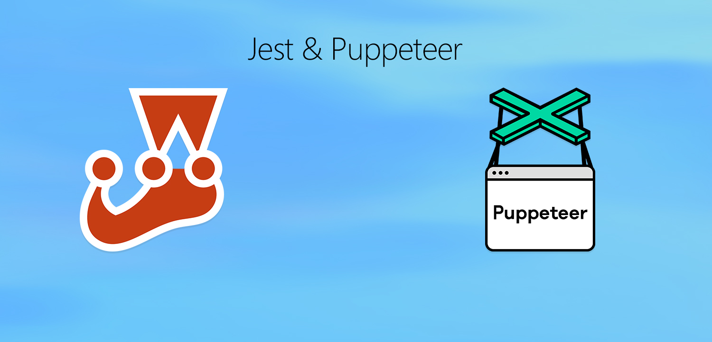

# github-e2e-test-tutorial

How to Write E2E Tests in Page Object Model (Using Jest and Puppeteer)
By the end of this article, you'll be better skilled on how to write a full E2E Tests framework.
TL;DR - The article will give you a good idea of how to write an E2E test ( a full system end-to-end test) using Jest and Puppeteer. We will define, design, and implement E2E tests for a web app/web application, step by step, and with code examples. Here is the full GitHub repository for the project.

Make sure to create your own cred.js file. Type and export your userName and password, e.g:

exports.userName = 'someUserName'

exports.password = '12345678'

// Fill in your Github login info.

Then, please run

$ npm install 

$ npm test

"E2E test as an end-user, perform the tests below:"

- "As an end-user, the search-input directs to a proper search result page, and confirmed by the page title"

This repo is part of a medium article, covering E2E tests tutorial.
